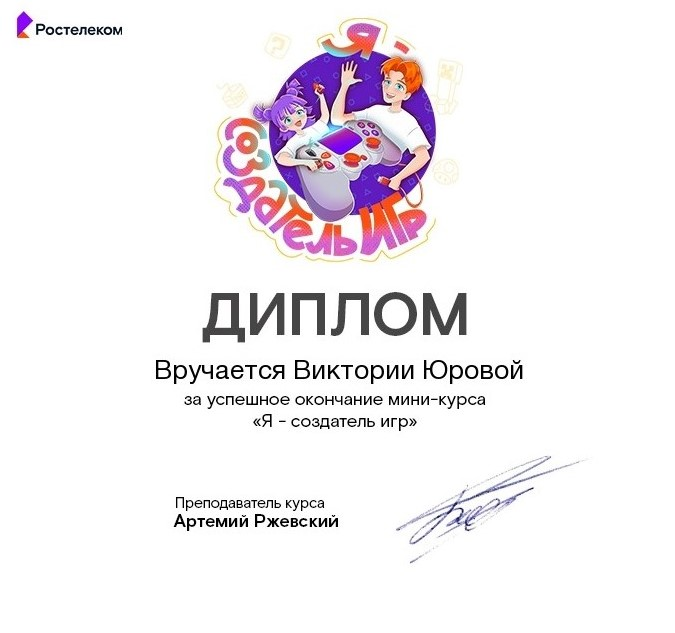

# 🏆 Мои сертификаты и достижения

Здесь собраны мои официальные подтверждения навыков в программировании и 3D-моделировании.

## 💻 Программирование

| Курс / Сертификация | Платформа | Дата | Статус | Ссылка |
|---------------------|-----------|------|--------|--------|
| **Python** | Алгоритмика | Декабрь 2025 | ✅ Получен | [🔗]() |
| **Машинное обучение** | Код будущего (МФТИ) | Декабрь 2025 | ✅ Получен | [🔗]() |

## 🎨 3D-моделирование

| Курс / Достижение | Платформа / Конкурс | Дата | Статус | Ссылка |
|-------------------|---------------------|------|--------|--------|
| **Я - создатель игр** | Ростелеком | Октябрь 2025 | ✅ Пройден | [🔗]() |

*Последнее обновление: Апрель 2026*
